

  <a href="https://im-rihan.github.io/">
    
  </a>

   

  

   

  
  
  
  

---

  

  <a href="https://ziffy.ai">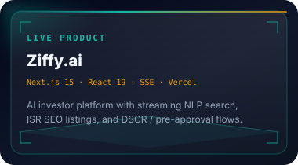</a>
  <a href="https://im-rihan.github.io/work/nestjs-appi-api/"></a>
  <a href="https://im-rihan.github.io/work/php-3rdpartycomms/"></a>

  
  
  
  

<strong>More systems</strong> — expand for the full production set

 

  

  <a href="https://im-rihan.github.io/work/ha-realtor-plat/">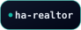</a>
  
  
  
  

---

  
   
  

---

  

  <a href="https://ziffy.ai"></a>
  <a href="https://homeabroadinc.com">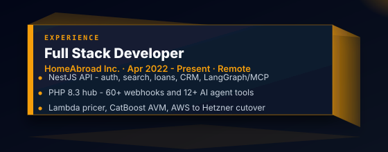</a>

---

  

<!-- Pac-Man via jsDelivr (stable through GitHub camo); stats via github-stats-extended -->

 

---

